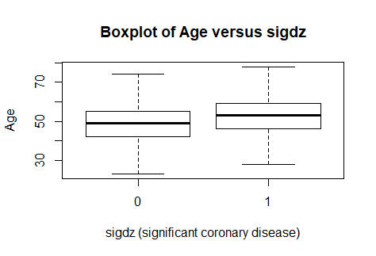
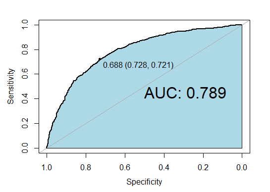

# Logistic Regression Model for Prediction of Coronary Disease
A regression model is designed for prediction of coronary disease. This model evaluates the effect of sex, age, and cholesterol on the probability of
coronary disease. This dataset is from the Duke University Cardiovascular Disease Databank and consists of 2258 patients and 6 variables. The patients were referred to Duke University Medical Center for chest pain. The variables included in the dataset "acath2.csv" are the following:

- sex: sex of the patient (0=male, 1=female)
- age: age of the patient
- cad.dur: duration of symptoms of coronary artery dsisea
- cholest: cholesterol (in mg)
- sigdz: significant coronary disease by cardiac catheterization (defined as >= 75% diameter narrowing in at least one important coronary artery: 1=yes, 0=no)
- tvdlm: severe coronary disease (defined as three vessel or left main disease by cardiac catheterization: 1=yes, 0=no)

First, the path of the working directory is set.  
```sh
# Working directory which contains the data file (please change accordingly)  
dir = "F:/RProjects/LRM"
setwd(dir)
```

Then, read in the dataset:

```sh
CPdata <- read.csv("acath2.csv")
```
Before designing logistic regression model, drawing boxplot of each variable with respect to significant coronary disease status can be useful to catch the behaviour of each variable. For instance, boxplot of age versus sigdz (defined above) is as follows:



It looks like the age of patients with coronary disease is generally higher. The same can be done for the rest of variables.  
We can run logistic regression (and many other kinds of regression) using the glm function. For logistic regression, we have to specify the parameter family=binomial:

```sh
CPfit2 <- glm(sigdz~sex + age + cholest, data = CPdata, family = "binomial")
```

To get the odds ratio for variables, we need to exponentiate the coefficients. For example, the odds ratio for the effect of cholesterol:
```sh
exp(CPfit2$coefficients[2])  
## (Intercept)      sex        age       cholest  
## 0.0153307     0.1231459  1.0724942   1.0090463  
```

Interpretation for OR (odds ratio) of sex: the odds of significant coronary disease among female is 0.1231 times as the odds of significant coronary disease among male, among the patients with the same level of cholesterol and the same age. The same interpretation can be made for the other two variables (age & cholest).

Furthermore, the 95% confidence interval can be calculated:
```sh
exp(confint(CPfit2))  
##                   2.5 %         97.5 %
## (Intercept)    0.007212296    0.03201997
## sex            0.098380930    0.15341970
## age            1.060440958    1.08497168
## cholest        1.006947174    1.01120648
```
If the confidence interval for the odds ratio does not overlap the value 1, then the variable is a significant predictor of coronary disease.  
  
  
In order to evaluate the performance of the designed logistic regression model, let's create an ROC curve (receiver operating characteristic curve) for our logistic regression model.  

```sh
auc(CPdata$sigdz, PredValues2, plot=TRUE, print.thres="best",
    auc.polygon=TRUE, auc.polygon.col="lightblue", asp=FALSE,
    print.auc=TRUE, print.auc.cex=2)
```



The ROC curve allows us to visualize the sensitivity-specificity tradeoff for our logistic regression model. The diagonal line represents what the ROC curve would look like for a random predictor. The curve for a good model is close to the top left corner of the plot. The ROC curve is great for visualization, but we usually want a value that summarizes goodness of fit. We can measure how close the curve is to the top left corner by looking at the area under the ROC curve (AUC). As can be seen from the above curve, the AUC is 0.789.
